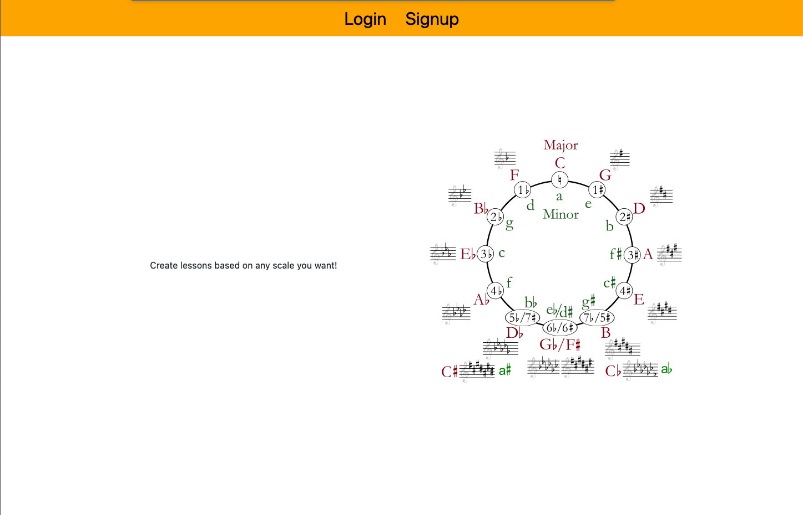
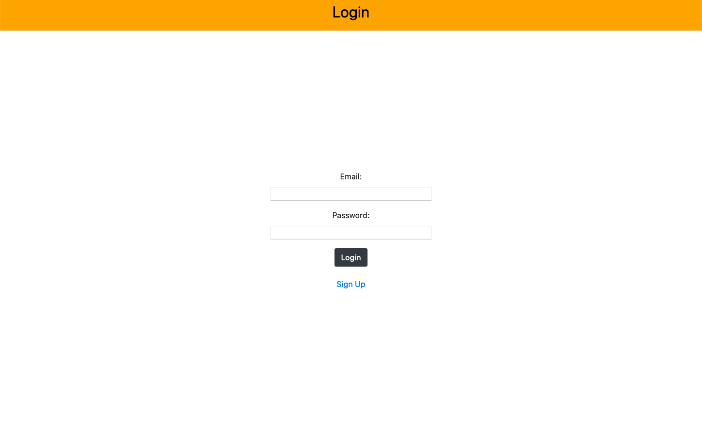
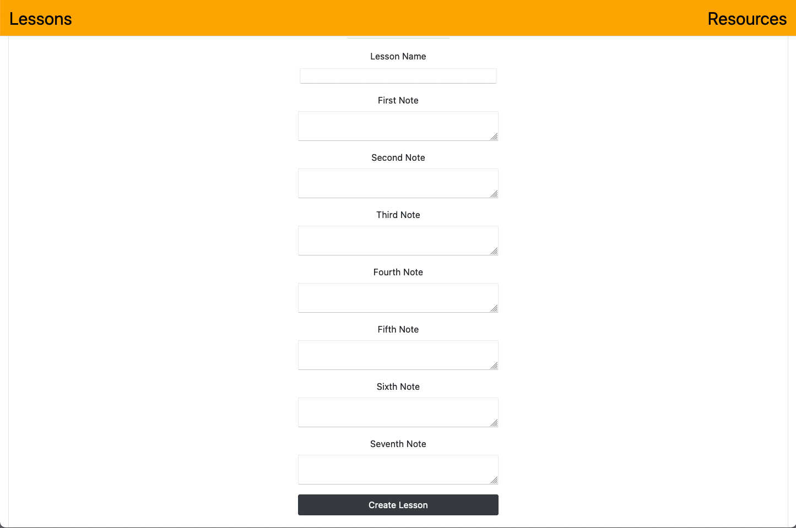
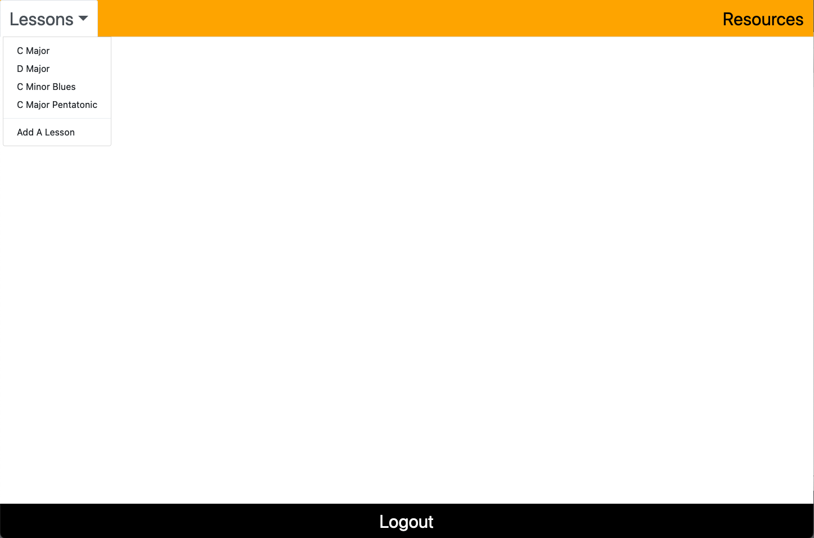
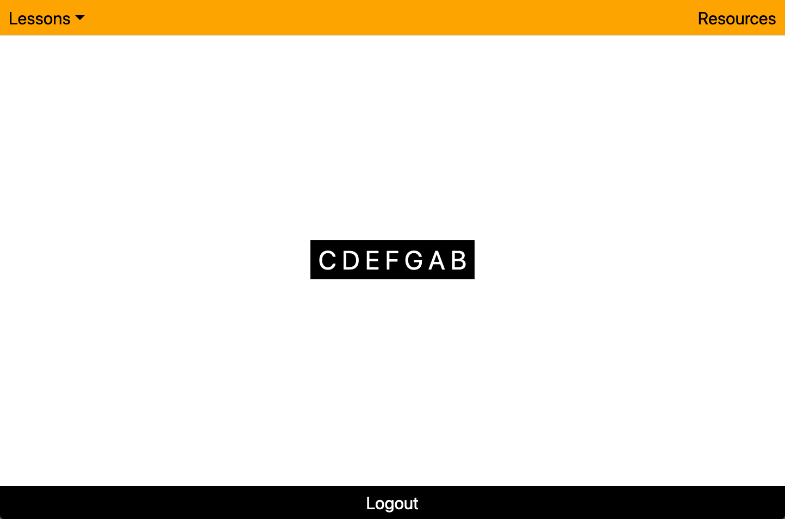
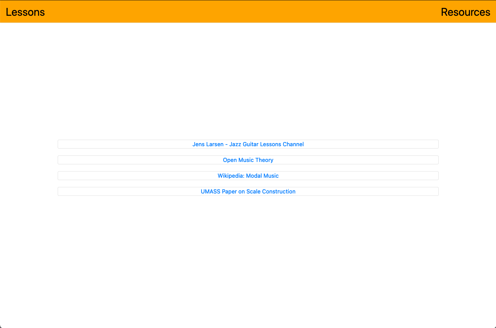

# Scaled

## Full stack web application where users can create and view their own musical scale lessons. Currently supports lessons of 7 or fewer notes. Future updates will include support for the full chromatic scale, ~~as well as the pitch detection model from the [ml5js](https://github.com/ml5js) team.~~

#### UPDATE: Now supports playing through individual notes of the lessons, thanks to Chris Wilson's [pitch detection algorithm](https://github.com/cwilso/PitchDetect). Works decently well with my guitar, but will pick up and possibly match with other sounds from the environment. For this reason, I would recommend practicing in a quiet space, or using an audio interface, if possible. 

#

## Table of Contents

- [Installation](#Installation)
- [Usage](#Usage)
- [Credits](#Credits)
- [License](#License)

## Installation

If you want to fork this repo, the dependencies should be included in the package.json, so just run npm install to get everything set up. 
Otherwise, the link to the deployed version can be found below. 

## Usage

The live application can be found [here](https://sleepy-falls-53764.herokuapp.com/lessons). Feel free to make an account and check it out yourself. 

## Credits

[Matt Reisdorf](https://github.com/MattReisdorf)

[Karina Ayala](https://github.com/Karina1023)

[Harrison Blackburn](https://github.com/harrisonblackburn)

[Jason Carrazco](https://github.com/JAC61090)

## License

The Unlicense

http://unlicense.org/